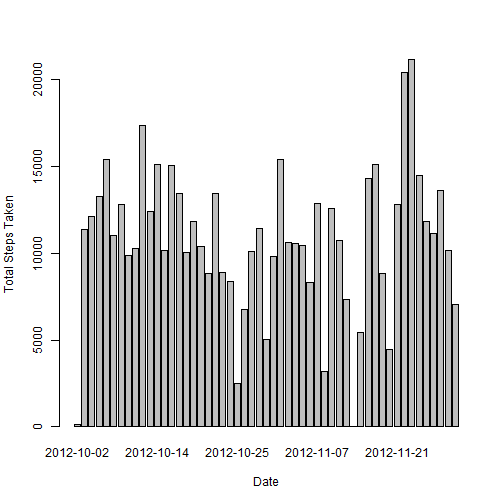
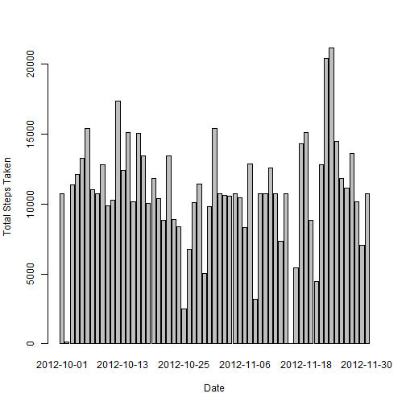
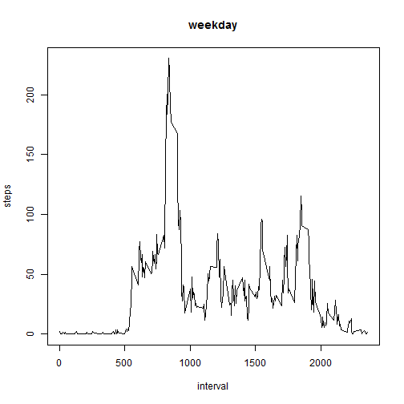
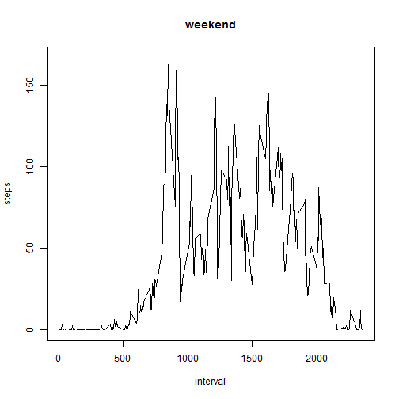

##Loading and preprocessing the data


```r
unzip(zipfile="activity.zip")
adata <- read.csv("activity.csv")
```

##Calculate the mean total number of steps taken per day


```r
stepsByDate <- aggregate(steps ~ date, data = adata, FUN = sum)
```
**1. Histogram of total steps by date**

```r
barplot(stepsByDate$steps, names.arg = stepsByDate$date, xlab = "Date",
        ylab = "Total Steps Taken")
```

 


**2. The mean steps taken by date is 10766.19 and the median is 10765**

##The average daily activity pattern

**1. Time series plot of the 5-minute interval and the average number of steps taken**

```r
stepsByInterval <- aggregate(steps ~ interval, data = adata, FUN = mean)
plot(stepsByInterval, type = "l")
```

 

**2. The 5-minute interval, on average across all the days in the dataset, that contains the maximum number of steps**


```r
stepsByInterval$interval[which.max(stepsByInterval$steps)]
```

```
## [1] 835
```

##Imputing missing values##

**1.The total number of missing values in the dataset (i.e. the total number of rows with NAs)**


```r
sum(is.na(adata))
```

```
## [1] 2304
```

**2.The strategy for NAs is to replace with the mean value of its 5-minute interval**


```r
HandleNA <- function(steps, interval) {
    NAList <- NA
    if (!is.na(steps))
        NAList <- c(steps)
    else
        NAList <- (meanByInt[meanByInt$interval==interval, "steps"])
    return(NAList)
}

meanByInt <- aggregate(x=list(steps=adata$steps),by=list(interval=adata$interval),FUN=mean, na.rm=TRUE)
bdata <- adata
bdata$steps <- mapply(HandleNA, bdata$steps, bdata$interval)
```
**3.New dataset created with NA filled by the mean for the 5-minute interval **

**4. Calculate the mean total number of steps taken per day **


```r
stepsByDatex <- aggregate(steps ~ date, data = bdata, FUN = sum)
```

**Histogram of total steps by date**


```r
barplot(stepsByDatex$steps, names.arg = stepsByDatex$date, xlab = "Date",
        ylab = "Total Steps Taken")
```

 


**The mean steps taken by date is 10766.19 and the median is 10766.19**

*The impact of filling in the NA with mean for 5-minute intervals is negligible*

##Differences in activity patterns between weekdays and weekends##

**1.Create a new factor variable in the dataset with two levels – “weekday” and “weekend” **

```r
typeOfDay <- function(date) {
    if (weekdays(as.Date(date)) %in% c("Saturday", "Sunday")) {
        "weekend"
    } else {
        "weekday"
    }
}
bdata$typeOfDay <- as.factor(sapply(bdata$date, typeOfDay))
```
**2. Make a panel plot containing a time series plot**


```r
weekdata <- aggregate(steps ~ interval, data = bdata, subset = bdata$typeOfDay == "weekday", FUN = mean)
weekenddata <- aggregate(steps ~ interval, data = bdata, subset = bdata$typeOfDay == "weekend", FUN = mean)
plot(weekdata, type = "l", main = "weekday")
```

 

```r
plot(weekenddata, type = "l", main = "weekend")
```

 
